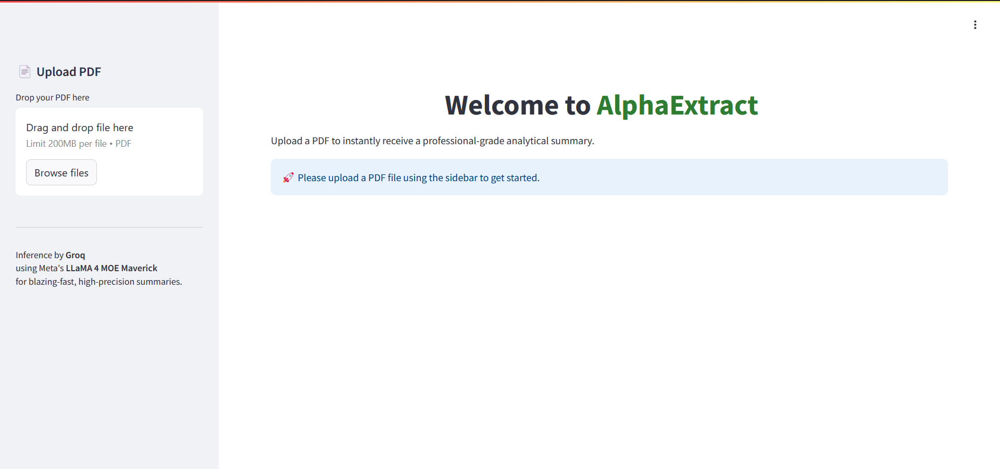

# AlphaExtract - AI-powered PDF Summarizer

**AlphaExtract** is a cutting-edge PDF summarization tool that leverages state-of-the-art AI models to extract and synthesize information from PDF documents. Built with Meta's LLaMA 4 MOE Maverick model and powered by Groq's inference engine, it provides blazing-fast, high-precision summaries for any PDF document.

---

## Features

- **Intelligent PDF Processing**: Convert PDFs to images and extract detailed information
- **Advanced Summarization**: Generate comprehensive, well-structured summaries using LLaMA 4 MOE Maverick
- **Professional PDF Export**: Download summaries as beautifully formatted PDF documents
- **Modern Web Interface**: Clean, responsive UI built with Streamlit
- **Parallel Processing**: Multi-threaded extraction for improved performance
- **Docker Support**: Easy deployment with containerization
- **CI/CD Integration**: Automated Docker image builds and pushes

---

## Table of Contents

1. [Architecture](#architecture)
2. [Technical Stack](#technical-stack)
3. [Requirements](#requirements)
4. [Installation](#installation)
5. [Usage](#usage)
6. [Docker Deployment](#docker-deployment)
7. [Project Structure](#project-structure)
8. [Screenshots](#screenshots)

---

## Architecture

AlphaExtract follows a pipeline architecture with three main components:

1. **PDF Processing**: Converts PDF documents to images for processing
2. **Detail Extraction**: Uses LLaMA 4 MOE Maverick to extract detailed information from each page
3. **Summary Generation**: Synthesizes extracted information into a coherent, analytical summary

The pipeline is optimized for parallel processing and handles documents of varying lengths efficiently.

---

## Technical Stack

- **Language**: Python 3.10
- **Web Framework**: Streamlit
- **AI Models**: Meta's LLaMA 4 MOE Maverick
- **Inference Engine**: Groq
- **PDF Processing**: pdf2image, ReportLab
- **Package Management**: uv
- **Containerization**: Docker
- **CI/CD**: GitHub Actions

---

## Requirements

- Python 3.10 or higher
- Dependencies listed in `pyproject.toml`
- Groq API key for inference
- Poppler utils for PDF processing

---

## Installation

1. Clone the repository:
   ```bash
   git clone https://github.com/yourusername/AlphaExtract.git
   cd AlphaExtract
   ```

2. Install dependencies using uv:
   ```bash
   curl -LsSf https://astral.sh/uv/install.sh | sh
   uv sync
   ```

3. Set up environment variables:
   ```bash
   export GROQ_API_KEY=your_api_key_here
   ```

4. Run the application:
   ```bash
   streamlit run main.py
   ```

---

## Usage

1. Access the web interface at `http://localhost:7860`
2. Upload your PDF document using the sidebar
3. Wait for the processing to complete
4. View the generated summary
5. Download the summary as a PDF document

---

## Docker Deployment

1. Build the Docker image:
   ```bash
   docker build -t alphaextract .
   ```

2. Run the container:
   ```bash
   docker run -p 7860:7860 -e GROQ_API_KEY=your_api_key_here alphaextract
   ```

The application will be available at `http://localhost:7860`.

---

## Project Structure

```
AlphaExtract/
├── .github/
│   └── workflows/
│       └── dockerhubPush.yaml
├── src/
│   ├── components/
│   │   ├── extractPdfDetails.py
│   │   └── summaryEngine.py
│   ├── pipelines/
│   │   └── pipeline.py
│   └── utils/
│       ├── functions.py
│       └── logger.py
├── config.ini
├── Dockerfile
├── main.py
├── prompts.yaml
└── pyproject.toml
```

### Key Components

- `main.py`: Streamlit web application entry point
- `src/components/`: Core processing modules
- `src/pipelines/`: Pipeline orchestration
- `config.ini`: Configuration settings
- `prompts.yaml`: LLM system prompts
- `Dockerfile`: Container configuration
- `.github/workflows/`: CI/CD configuration

---

## Screenshots

- Project Demo
{width=1920px}
*Complete demonstration of PDF upload, processing, and summary generation*

- Application Interface
{width=1920px}
*The clean and intuitive application interface*

---

## License

This project is licensed under the MIT License.

---

## Author

Created with ❤️ by [**Rauhan Ahmed Siddiqui**](https://github.com/RauhanAhmed/AlphaExtract).

For questions or support, please open an issue on the GitHub repository.